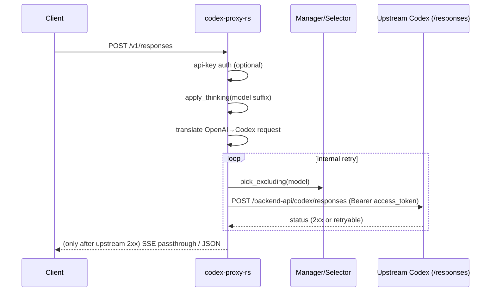
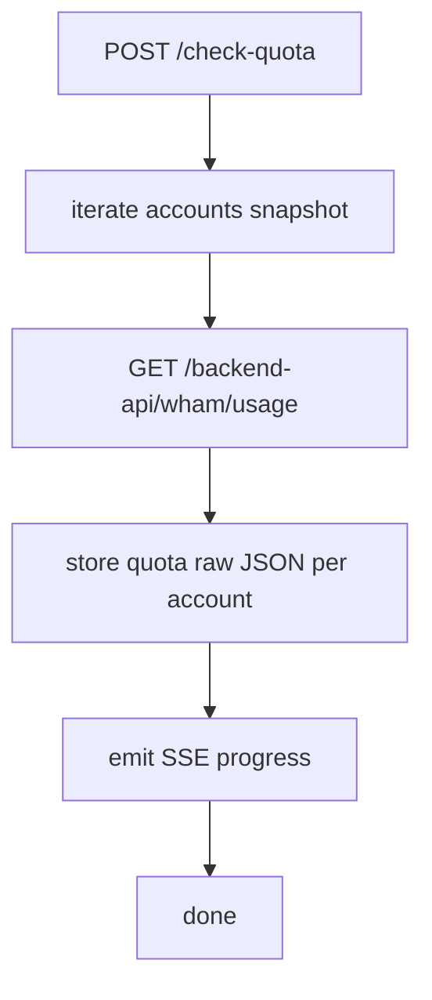

# codex-proxy-rs

Rust 重写版 `codex-proxy`（参考同级目录 `../codex-proxy` 的 Go 实现）。

提供 OpenAI 兼容的 HTTP 端点，将请求转换为 ChatGPT Codex 后端 `/backend-api/codex/responses` 请求并在多账号之间做内部重试。

## 功能概览

- OpenAI 兼容端点：
  - `POST /v1/responses`（流式/非流式，透传上游 Responses SSE 或 response 对象）
  - `POST /v1/responses/compact`（流式/非流式，透传上游 Compact 响应）
  - `POST /v1/chat/completions`（流式/非流式，上游 Responses SSE → Chat Completions 转换）
  - `GET /v1/models`（生成 thinking 后缀与 `-fast` 变体）
- Claude 兼容端点：
  - `POST /v1/messages`（流式/非流式，Codex Responses SSE → Claude Messages 格式）
- 管理端点：
  - `GET /stats`（账号 summary + RPM + token totals + quota raw JSON cache）
  - `POST /check-quota`（SSE，批量查询 `/backend-api/wham/usage`）
  - `POST /refresh`（SSE，强制刷新所有账号 Token）
  - `GET /health`（不鉴权）
- 多账号池 + 内部重试：
  - 从 `auth-dir` 读取 `*.json`（access_token/refresh_token/account_id/email/expired）
  - 账号切换重试（400/403 不重试，其它可重试）
  - **SSE gate**：仅在拿到上游 **2xx** 后才向下游返回流式响应（客户端“无感重试”）
- 后台任务（可取消）：
  - refresh loop：定时扫描新增 auth 文件并并发刷新即将过期的 Token
  - health checker：探测 `/responses` 并对 401/403/429 做移除/冷却处理
  - keepalive：周期性 HEAD ping 上游，保持连接池热度

## 运行

```bash
cd codex-proxy-rs
cargo run -- --config config.yaml
```

## Docker

```bash
cd codex-proxy-rs
docker build -t codex-proxy-rs .
docker run --rm -p 8080:8080 \
  -v $(pwd)/config.yaml:/app/config.yaml:ro \
  -v $(pwd)/auths:/app/auths \
  codex-proxy-rs
```

如果构建阶段出现 DNS/解析超时（如 `crates.io` / `deb.debian.org`），可尝试：

```bash
docker build --network=host -t codex-proxy-rs .
```

也提供 `docker-compose.yml`：

```bash
docker compose up --build
```

### 配置示例（`config.yaml`）

```yaml
# 监听地址（Go 兼容写法）
listen: ":8080"

# 账号目录（里面放 *.json token 文件）
auth-dir: "./auths"

# 上游 Codex base url（不配则按 backend-domain 拼）
base-url: "https://chatgpt.com/backend-api/codex"
backend-domain: "chatgpt.com"

# 可选：全局代理（同时用于 upstream + quota + health + keepalive）
proxy-url: ""

# 日志级别：debug|info|warn|error
log-level: "info"

# 内部重试次数（0 表示不重试；总尝试次数 = max-retry + 1）
max-retry: 2

# API key 鉴权（为空则不鉴权；支持 Authorization Bearer / x-api-key / api-key）
api-keys:
  - "your-api-key"

# health checker（0 禁用）
health-check-interval: 300
health-check-max-failures: 3
health-check-concurrency: 5
health-check-start-delay: 45
health-check-batch-size: 20
health-check-request-timeout: 8

# 网络配置（对齐说明见 docs/network.md）
enable-http2: true
# backend-resolve-address: "1.2.3.4" # or "host:port"
max-conns-per-host: 20
max-idle-conns: 50
max-idle-conns-per-host: 10

# 其他配置项
refresh-interval: 3000
refresh-concurrency: 50
startup-async-load: true
startup-load-retry-interval: 10
shutdown-timeout: 5
auth-scan-interval: 30
save-workers: 4
cooldown-401-sec: 30
cooldown-429-sec: 60
refresh-single-timeout-sec: 30
quota-check-concurrency: 50
keepalive-interval: 60
upstream-timeout-sec: 0
empty-retry-max: 2
selector: "round-robin" # or "quota-first"
refresh-batch-size: 0

# 这两个配置当前与 Go 一样仅保留配置面
stream-idle-timeout-sec: 0
enable-stream-idle-retry: true
```

### auth 文件示例（`auths/a.json`）

```json
{
  "access_token": "at-xxx",
  "refresh_token": "rt-xxx",
  "account_id": "acc-xxx",
  "email": "a@example.com",
  "type": "codex",
  "expired": "2099-01-01T00:00:00Z"
}
```

## API key 鉴权

当 `api-keys` 配置非空时：

- 受保护：`/v1/*`、`/stats`、`/check-quota`
- 不鉴权：`/health`

支持以下 header 任一方式：

```bash
Authorization: Bearer <api-key>
x-api-key: <api-key>
api-key: <api-key>
```

## cURL 示例

### 1) 模型列表

```bash
curl -sS http://127.0.0.1:8080/v1/models \
  -H 'Authorization: Bearer your-api-key'
```

### 2) Responses API（非流式）

```bash
curl -sS http://127.0.0.1:8080/v1/responses \
  -H 'Authorization: Bearer your-api-key' \
  -H 'Content-Type: application/json' \
  -d '{"model":"gpt-5.4","stream":false,"input":"hello"}'
```

### 3) Responses API（流式）

```bash
curl -N http://127.0.0.1:8080/v1/responses \
  -H 'Authorization: Bearer your-api-key' \
  -H 'Content-Type: application/json' \
  -d '{"model":"gpt-5.4","stream":true,"input":"hello"}'
```

### 3.1) Responses Compact（流式）

```bash
curl -N http://127.0.0.1:8080/v1/responses/compact \
  -H 'Authorization: Bearer your-api-key' \
  -H 'Content-Type: application/json' \
  -d '{"model":"gpt-5.4","stream":true,"input":"hello"}'
```

### 4) Chat Completions（非流式）

```bash
curl -sS http://127.0.0.1:8080/v1/chat/completions \
  -H 'Authorization: Bearer your-api-key' \
  -H 'Content-Type: application/json' \
  -d '{"model":"gpt-5.4","stream":false,"messages":[{"role":"user","content":"hello"}]}'
```

### 5) Chat Completions（流式）

```bash
curl -N http://127.0.0.1:8080/v1/chat/completions \
  -H 'Authorization: Bearer your-api-key' \
  -H 'Content-Type: application/json' \
  -d '{"model":"gpt-5.4","stream":true,"messages":[{"role":"user","content":"hello"}]}'
```

### 5.1) Claude Messages（流式）

```bash
curl -N http://127.0.0.1:8080/v1/messages \
  -H 'Authorization: Bearer your-api-key' \
  -H 'Content-Type: application/json' \
  -d '{"model":"gpt-5.4","stream":true,"max_tokens":64,"messages":[{"role":"user","content":"hello"}]}'
```

### 6) 查询剩余额度（SSE）

```bash
curl -N -X POST http://127.0.0.1:8080/check-quota \
  -H 'Authorization: Bearer your-api-key'
```

### 7) 查看账号统计 + quota cache

```bash
curl -sS http://127.0.0.1:8080/stats \
  -H 'Authorization: Bearer your-api-key'
```

### 8) 手动刷新所有账号 Token（SSE）

```bash
curl -N -X POST http://127.0.0.1:8080/refresh \
  -H 'Authorization: Bearer your-api-key'
```

## 模型后缀：thinking / fast

之所以用 `model` 名后缀表达这些开关，是为了兼容更多“只允许选择 model、不方便改请求体字段”的客户端；代理在内部会剥离后缀并映射到上游请求参数。

### thinking（通过模型名后缀控制）

客户端可用 `model` 后缀表达“思考等级”，代理会将其写入上游请求的 `reasoning.effort`，并将去后缀的 base model 作为真实模型名。

不同基础模型支持的 thinking 后缀并不完全相同；以当前 Go 版为准：

- `gpt-5.4-low`
- `gpt-5.4-medium`
- `gpt-5.4-high`
- `gpt-5.4-xhigh`
- `gpt-5.4-none`
- `gpt-5.4-auto`
- `gpt-5-low` / `gpt-5-medium` / `gpt-5-high` / `gpt-5-auto`
- `gpt-5.1-codex-low|medium|high|max|auto`
- `gpt-5.1-codex-max-low|medium|high|xhigh|auto`
- `model-<budget>`（数字预算 > 100，会映射为等级）

完整可用模型矩阵请直接调用 `GET /v1/models`。

### fast（`-fast` 后缀）

`-fast` 会被解析并映射到上游 `service_tier: "priority"`，与最新 Go 版一致。

因此 `gpt-5.4-fast`、`gpt-5.1-codex-max-high-fast` 这类变体都会在 `/v1/models` 中列出，并实际影响上游优先级。

## 流程图

### /v1/responses（内部重试 + SSE gate）



### /check-quota（wham/usage cache）



## 现状与差异（相对 Go）

- 已实现：`/v1/responses`（含 websocket fallback）、`/v1/responses/compact`、`/v1/chat/completions`、`/v1/messages`、`/v1/models`、`/stats`、`/check-quota`、`/refresh`、refresh loop、health checker、keepalive
- 未实现（待补齐）：上游原生 websocket 转发等（当前只实现 Go 同款 fallback）

更多对齐清单见 `docs/parity.md`。
