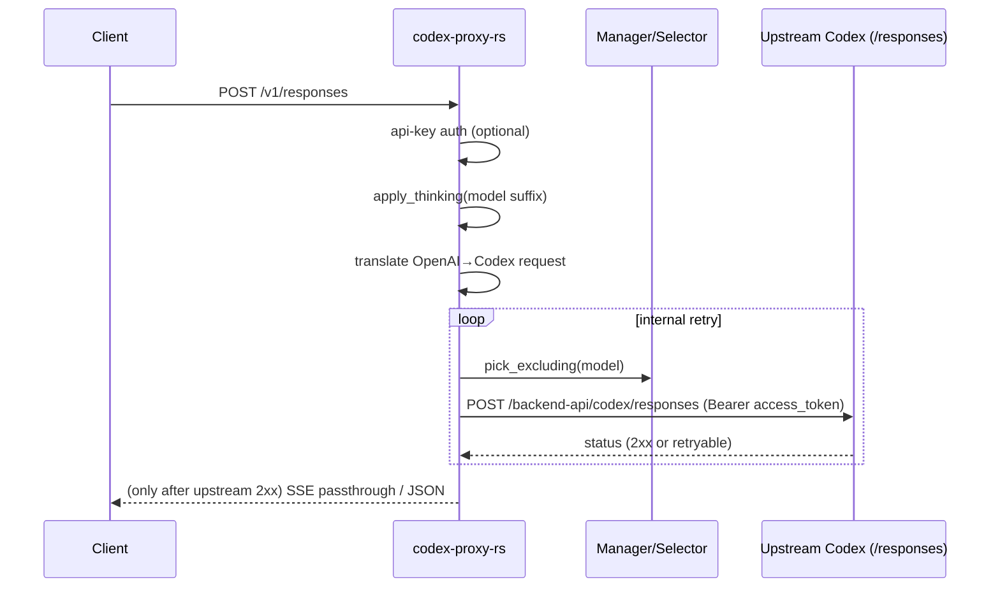
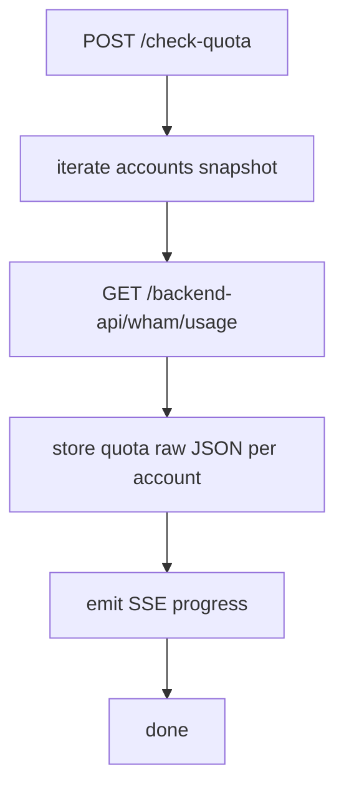

# codex-proxy-rs

Rust 重写版 `codex-proxy`（参考同级目录 `../codex-proxy` 的 Go 实现）。

提供 Codex Responses 代理端点，将请求转发到 ChatGPT Codex 后端 `/backend-api/codex/responses` 并在多账号之间做内部重试。

## 功能概览

- Codex 代理端点：
  - `POST /v1/responses`（流式/非流式，透传上游 Responses SSE 或 response 对象）
  - `POST /v1/responses/compact`（流式/非流式，透传上游 Compact 响应）
  - `/v1/responses` WebSocket（默认 HTTP/SSE fallback，可实验性开启原生 Codex WS 代理）
  - `GET /v1/models`（生成 thinking 后缀与 `-fast` 变体）
  - 不再提供 `/v1/chat/completions`、`/v1/completions`、`/v1/messages`、`/v1/images/*` 等格式转换/桥接端点；这些能力由上层 gateway 处理。
- 管理端点：
  - `GET /stats`（账号 summary + RPM + token totals + quota raw JSON cache）
  - `GET /admin/request-logs` / `GET /admin/usage-logs` / `GET /admin/account-status`（SQLite 持久化查询，需开启 `persistence.enabled`）
  - `GET /admin/rate-limits`（当前 key/account 限流配置）
  - `GET /admin/persistence`（SQLite writer 状态与 dropped/write error 计数）
  - `POST /check-quota`（SSE，批量查询 `/backend-api/wham/usage`）
  - `POST /refresh`（SSE，强制刷新所有账号 Token）
  - `GET /health`（不鉴权）
- 运行时保护：
  - SQLite 持久化 request log / usage log / account status
  - API key 级 RPM 与并发限制
  - account 级 RPM 与并发限制
- 多账号池 + 内部重试：
  - 从 `auth-dir` 读取 `*.json`（`access_token` 必填；`refresh_token` 可选）
  - 兼容 `sub2api` 的单账号导出 JSON（顶层 `accounts[0].credentials`）
  - 账号切换重试（400/403 不重试，其它可重试）
  - **SSE gate**：仅在拿到上游 **2xx** 后才向下游返回流式响应（客户端“无感重试”）
- 后台任务（可取消）：
  - refresh loop：定时扫描新增 auth 文件，并并发刷新即将过期且带 `refresh_token` 的 Token
  - health checker：探测 `/responses` 并对 401/403/429 做移除/冷却处理
  - keepalive：周期性 HEAD ping 上游，保持连接池热度

## 本地启动

```bash
cd codex-proxy-rs
cp config.example.yaml config.yaml
mkdir -p auths data
cargo run -- --config config.yaml
```

默认配置监听 `:18080`，浏览器打开：

```text
http://127.0.0.1:18080/
```

后端会托管 `frontend/dist`。如果改动了管理前端代码，先构建前端再启动后端：

```bash
cd frontend
npm ci
npm run build
cd ..
cargo run -- --config config.yaml
```

管理 UI 使用独立的管理员账号登录。`admin.password-hash` 为空时，首次打开页面会要求初始化用户名和密码；服务端会把 Argon2 密码哈希写回当前 `config.yaml`，不会保存明文密码。登录后可在 Settings 页面修改密码。

`config.example.yaml` 默认配置了 `api-keys: ["sk-123"]`。这个 key 用于 `/v1/*`、`/check-quota`、`/refresh` 等接口调用，不作为管理 UI 登录密码。

启动前至少需要在 `auths/` 放入一个账号 JSON。只有 `access_token` 也可以启动和发请求；带 `refresh_token` 的账号会参与自动刷新。

### 快速验收

```bash
curl -sS http://127.0.0.1:18080/health

curl -sS http://127.0.0.1:18080/admin/persistence \
  -H 'Authorization: Bearer sk-123'

curl -sS http://127.0.0.1:18080/admin/rate-limits \
  -H 'Authorization: Bearer sk-123'
```

发一条非流式请求：

```bash
curl -sS http://127.0.0.1:18080/v1/responses \
  -H 'Authorization: Bearer sk-123' \
  -H 'Content-Type: application/json' \
  -d '{"model":"gpt-5.4","stream":false,"input":"hello"}'
```

请求完成后可检查 SQLite 日志：

```bash
curl -sS 'http://127.0.0.1:18080/admin/request-logs?limit=10' \
  -H 'Authorization: Bearer sk-123'

curl -sS 'http://127.0.0.1:18080/admin/usage-logs?limit=10' \
  -H 'Authorization: Bearer sk-123'
```

## Docker

当前仓库只维护本地 `Dockerfile` / `docker-compose.yml` 工作流，不发布 GHCR 镜像。

```bash
cd codex-proxy-rs
docker build --network=host -t codex-proxy-rs .
docker run --rm -p 18080:18080 \
  -v $(pwd)/config.yaml:/app/config.yaml:ro \
  -v $(pwd)/auths:/app/auths \
  -v $(pwd)/data:/app/data \
  codex-proxy-rs:latest
```

`--network=host` 主要用于构建阶段访问 `crates.io`、`registry.npmjs.org`、`deb.debian.org` 等外部源；如果你的 Docker 网络环境正常，也可以去掉。

如果要按当前验收镜像名构建：

```bash
docker build --network=host -t codex-proxy-rs:verify .
```

也提供 `docker-compose.yml`：

```bash
docker compose up --build
```

### 配置示例（`config.yaml`）

完整示例见仓库根目录 [`config.example.yaml`](./config.example.yaml)。

- `base-url` 优先级高于 `backend-domain`
- `enable-http2: true` 默认开启，控制的是代理访问上游 Codex / quota / health / keepalive 的出站 HTTP client，不是入站监听协议
- 如果上游出现 `GOAWAY ENHANCE_YOUR_CALM`，优先调低 `max-idle-conns-per-host`，必要时再将 `enable-http2` 设为 `false`

更多网络配置说明见 [`docs/network.md`](./docs/network.md)。

## Release

推送匹配 `v*` 的 tag 会触发 GitHub Actions：

- 构建原始二进制：Linux x86_64、Windows x86_64、macOS x86_64、macOS arm64
- 创建 GitHub Release 资产：各平台二进制、`config.example.yaml`、`SHA256SUMS`

当前 workflow：

- 不打 zip
- 不发布 Docker 镜像
- 可通过 `workflow_dispatch` 手动触发构建；只有 tag 触发会发布 Release

### auth 文件示例（`auths/a.json`）

`refresh_token` 是可选的：启动时加载和运行中热加载都支持只有 `access_token` 的账号文件；这类账号可用于请求，但不会参与 refresh。

```json
{
  "access_token": "at-xxx",
  "refresh_token": "rt-xxx",
  "account_id": "acc-xxx",
  "email": "a@example.com",
  "type": "codex",
  "expired": "2099-01-01T00:00:00Z"
}
```

## API key 鉴权

当 `api-keys` 配置非空时：

- 受保护：`/v1/*`、`/stats`、`/admin/*`、`/check-quota`、`/refresh`
- 不鉴权：`/health`

支持以下 header 任一方式：

```bash
Authorization: Bearer <api-key>
x-api-key: <api-key>
api-key: <api-key>
```

## cURL 示例

### 1) 模型列表

```bash
curl -sS http://127.0.0.1:18080/v1/models \
  -H 'Authorization: Bearer your-api-key'
```

### 2) Responses API（非流式）

```bash
curl -sS http://127.0.0.1:18080/v1/responses \
  -H 'Authorization: Bearer your-api-key' \
  -H 'Content-Type: application/json' \
  -d '{"model":"gpt-5.4","stream":false,"input":"hello"}'
```

### 3) Responses API（流式）

```bash
curl -N http://127.0.0.1:18080/v1/responses \
  -H 'Authorization: Bearer your-api-key' \
  -H 'Content-Type: application/json' \
  -d '{"model":"gpt-5.4","stream":true,"input":"hello"}'
```

### 3.1) Responses Compact（流式）

```bash
curl -N http://127.0.0.1:18080/v1/responses/compact \
  -H 'Authorization: Bearer your-api-key' \
  -H 'Content-Type: application/json' \
  -d '{"model":"gpt-5.4","stream":true,"input":"hello"}'
```

### 4) 查询剩余额度（SSE）

```bash
curl -N -X POST http://127.0.0.1:18080/check-quota \
  -H 'Authorization: Bearer your-api-key'
```

### 5) 查看账号统计 + quota cache

```bash
curl -sS http://127.0.0.1:18080/stats \
  -H 'Authorization: Bearer your-api-key'
```

### 8) 手动刷新所有账号 Token（SSE）

```bash
curl -N -X POST http://127.0.0.1:18080/refresh \
  -H 'Authorization: Bearer your-api-key'
```

## 模型后缀：thinking / fast

之所以用 `model` 名后缀表达这些开关，是为了兼容更多“只允许选择 model、不方便改请求体字段”的客户端；代理在内部会剥离后缀并映射到上游请求参数。

### thinking（通过模型名后缀控制）

客户端可用 `model` 后缀表达“思考等级”，代理会将其写入上游请求的 `reasoning.effort`，并将去后缀的 base model 作为真实模型名。

不同基础模型支持的 thinking 后缀并不完全相同；以当前 Go 版为准：

- `gpt-5.4-low`
- `gpt-5.4-medium`
- `gpt-5.4-high`
- `gpt-5.4-xhigh`
- `gpt-5.4-none`
- `gpt-5.4-auto`
- `gpt-5-low` / `gpt-5-medium` / `gpt-5-high` / `gpt-5-auto`
- `gpt-5.1-codex-low|medium|high|max|auto`
- `gpt-5.1-codex-max-low|medium|high|xhigh|auto`
- `codex-auto-review-low|medium|high|xhigh`
- `model-<budget>`（数字预算 > 100，会映射为等级）

完整可用模型矩阵请直接调用 `GET /v1/models`。

### fast（`-fast` 后缀）

`-fast` 会被解析并映射到上游 `service_tier: "priority"`，与最新 Go 版一致。

因此 `gpt-5.4-fast`、`gpt-5.1-codex-max-high-fast` 这类变体都会在 `/v1/models` 中列出，并实际影响上游优先级。

## 流程图

### /v1/responses（内部重试 + SSE gate）


```mermaid
sequenceDiagram
  participant C as Client
  participant P as codex-proxy-rs
  participant M as Manager/Selector
  participant U as Upstream Codex (/responses)

  C->>P: POST /v1/responses
  P->>P: api-key auth (optional)
  P->>P: apply_thinking(model suffix)
  P->>P: translate OpenAI→Codex request
  loop internal retry
    P->>M: pick_excluding(model)
    P->>U: POST /backend-api/codex/responses (Bearer access_token)
    U-->>P: status (2xx or retryable)
  end
  P-->>C: (only after upstream 2xx) SSE passthrough / JSON
```

### /check-quota（wham/usage cache）


```mermaid
flowchart TD
  A[POST /check-quota] --> B[iterate accounts snapshot]
  B --> C[GET /backend-api/wham/usage]
  C --> D[store quota raw JSON per account]
  D --> E[emit SSE progress]
  E --> F[done]
```

## 现状与差异（相对 Go）

- 已实现：`/v1/responses`（含 websocket fallback、实验性原生上游 websocket 与 `response.append` 基础续写）、`/v1/responses/compact`、`/v1/models`、`/stats`、`/check-quota`、`/refresh`、refresh loop、health checker、keepalive
- 已移除：`/v1/chat/completions`、`/v1/completions`、`/v1/messages`、`/v1/messages/count_tokens`、`/v1/images/*` 及相关转换/桥接策略
- 未实现（待补齐）：上游原生 websocket 转发等（当前只实现 Go 同款 fallback）

更多对齐清单见 `docs/parity.md`。
